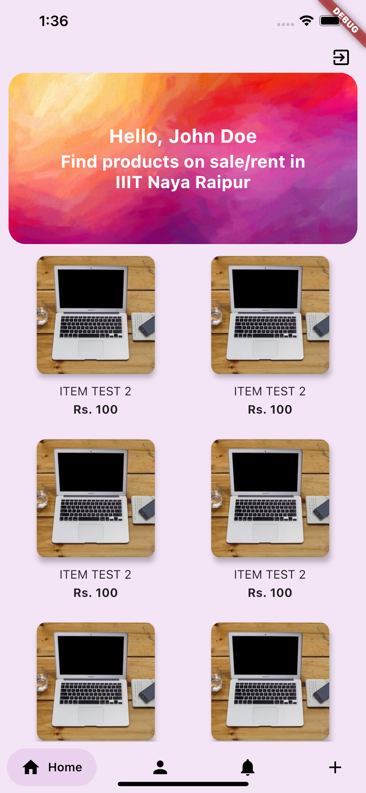

# College OLX - A Flutter Application

A local rentals app with streaming notifications and UPI payments integrated, specially designed for International Institute of Information Technology, Naya Raipur.  
State management is done using [Provider Package](https://pub.dev/packages/provider)  
Data is stored and retrived from [Google Firebase](https://firebase.google.com/)

## Screenshots

<p align="center">
  &nbsp;&nbsp;&nbsp;&nbsp;&nbsp;&nbsp;&nbsp;&nbsp;&nbsp;&nbsp;&nbsp;&nbsp;&nbsp;&nbsp;&nbsp;&nbsp;&nbsp;&nbsp;&nbsp;&nbsp;
</p>

## Flutter
For those of you who don't know, [flutter](https://flutter.dev/) is an open-source UI software development kit created by Google. It is used to develop applications for Android, iOS, Windows, Mac, Linux, Google Fuchsia and the web. Google claims building beautiful native applications in record time, using flutter. And I couldn't agree more!  
So fasten your seat belts and get ready for fluttering through *College OLX*

## Login/SignUp Screen
<p align= "center">
<br>
</p>

### Gradient  
Starting with the gradient in background, it can be added using [*LinearGradient*](https://api.flutter.dev/flutter/painting/LinearGradient-class.html) widget inside *BoxDecoration*. I've used this *BoxDecoration* inside *Container* Widget in the following code snippet:
```dart
Container(
            decoration: BoxDecoration(
              gradient: LinearGradient(
                colors: [Colors.white, Colors.indigo],
                begin: Alignment.topLeft,
                end: Alignment.bottomRight,
                stops: [0, 1],
              ),
            ),
          ),
```

### Red Box and Email-Pass Input Card
The Red Box with *College OLX* inside, has been fashioned using [*Flexible*](https://api.flutter.dev/flutter/widgets/Flexible-class.html) widget to give it the ability to expand in the available space. Decoration part of the container used inside Flexible is pretty standard as can be seen in the below code snippet:  
```dart
             child: Column(
                mainAxisAlignment: MainAxisAlignment.center,
                crossAxisAlignment: CrossAxisAlignment.center,
                children: <Widget>[
                  Flexible(
                    child: Container(
                      margin: EdgeInsets.only(bottom: 20.0),
                      padding:
                          EdgeInsets.symmetric(vertical: 8.0, horizontal: 94.0),
                      // ..translate(-10.0),
                      decoration: BoxDecoration(
                        borderRadius: BorderRadius.circular(20),
                        color: Colors.deepOrange.shade900,
                        boxShadow: [
                          BoxShadow(
                            blurRadius: 8,
                            color: Colors.black26,
                            offset: Offset(0, 2),
                          )
                        ],
                      ),
                      child: Text(
                        'CollegeOlx',
                        style: TextStyle(
                          color: Theme.of(context).accentTextTheme.title.color,
                          fontSize: 30,
                          fontFamily: 'Anton',
                          fontWeight: FontWeight.normal,
                        ),
                      ),
                    ),
                  ),
                  Flexible(
                    flex: deviceSize.width > 600 ? 5 : 4,
                    fit: FlexFit.loose,
                    child: AuthCard(),
                  ),
                ],
              ),
```
AuthCard is a custom widget to display they contents of form field based on the selected auth type (i.e., Login or signup), inside the flexible widget.

## Instructions for VS Code
### Run app without breakpoints
Click Debug > Start Without Debugging in the main IDE window, or press Ctrl+F5. The status bar turns orange to show you are in a debug session
### Run app with breakpoints
* If desired, set breakpoints in your source code.
* Click Debug > Start Debugging in the main IDE window, or press F5.
  * The left Debug Sidebar shows stack frames and variables.
  * The bottom Debug Console pane shows detailed logging output.
  * Debugging is based on a default launch configuration. To customize, click the cog at the top of the Debug Sidebar to create a         launch.json file. You can then modify the values.

## Instructions for Android Studio
* Locate the main Android Studio toolbar
* In the target selector, select an Android device for running the app. If none are listed as available, select Tools> Android > AVD Manager and create one there. For details, see Managing AVDs.
* Click the run icon in the toolbar, or invoke the menu item Run > Run.

