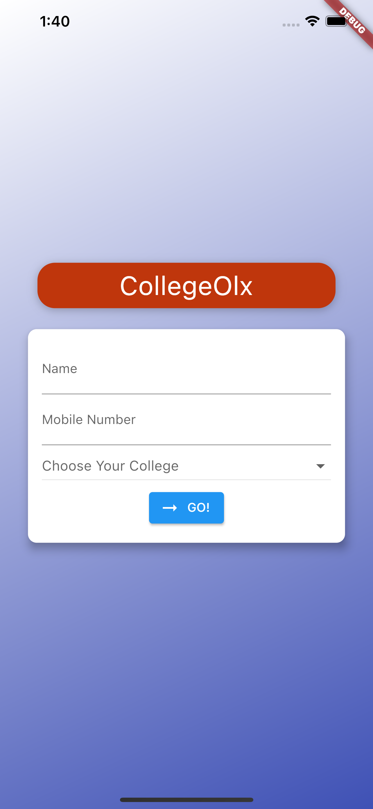

# College OLX - A Flutter Application

A local rentals app with streaming notifications and UPI payments integrated, specially designed for International Institute of Information Technology, Naya Raipur.  
State management is done using [Provider Package](https://pub.dev/packages/provider)  
Data is stored and retrived from [Google Firebase](https://firebase.google.com/)

```dart
Widget build(BuildContext context) {
    final deviceSize = MediaQuery.of(context).size;
    return Card(
      shape: RoundedRectangleBorder(
        borderRadius: BorderRadius.circular(10.0),
      ),
      elevation: 8.0,
      child: Container(
        constraints: BoxConstraints(
            minHeight: _authMode == AuthMode.Signup ? 550 : 260,
            maxHeight: _authMode == AuthMode.Signup ? 650 : 300),
        width: deviceSize.width * 0.85,
        padding: EdgeInsets.all(16.0),
        child: Form(
          key: _formKey,
          child: SingleChildScrollView(
            child: Column(
              children: <Widget>[
                if (_authMode == AuthMode.Signup)
                  TextFormField(
                    enabled: _authMode == AuthMode.Signup,
                    decoration: InputDecoration(
                        labelText: 'Name', labelStyle: TextStyle(fontSize: 15)),
                    onSaved: (value) {
                      _authData['SellerName'] = value;
                    },
                  ),
                TextFormField(
                  decoration: InputDecoration(
                      labelText: 'E-Mail', labelStyle: TextStyle(fontSize: 15)),
                  keyboardType: TextInputType.emailAddress,
                  validator: (value) {
                    if (value.isEmpty || !value.contains('@')) {
                      return 'Invalid email!';
                    }
                  },
                  onSaved: (value) {
                    _authData['email'] = value;
                  },
                ),
                TextFormField(
                  decoration: InputDecoration(
                      labelText: 'Password',
                      labelStyle: TextStyle(fontSize: 15)),
                  obscureText: true,
                  controller: _passwordController,
                  validator: (value) {
                    if (value.isEmpty || value.length < 5) {
                      return 'Password is too short!';
                    }
                  },
                  onSaved: (value) {
                    _authData['password'] = value;
                  },
                ),
                if (_authMode == AuthMode.Signup)
                  TextFormField(
                    enabled: _authMode == AuthMode.Signup,
                    decoration: InputDecoration(
                        labelText: 'Confirm Password',
                        labelStyle: TextStyle(fontSize: 15)),
                    obscureText: true,
                    validator: _authMode == AuthMode.Signup
                        ? (value) {
                            if (value != _passwordController.text) {
                              return 'Passwords do not match!';
                            }
                          }
                        : null,
                  ),
                if (_authMode == AuthMode.Signup)
                  TextFormField(
                    enabled: _authMode == AuthMode.Signup,
                    decoration: InputDecoration(
                        labelText: 'Hostel',
                        labelStyle: TextStyle(fontSize: 15)),
                    onSaved: (value) {
                      _authData['address'] = value;
                    },
                  ),
                if (_authMode == AuthMode.Signup)
                  TextFormField(
                    enabled: _authMode == AuthMode.Signup,
                    decoration: InputDecoration(
                        labelText: 'Room Number',
                        labelStyle: TextStyle(fontSize: 15)),
                    onSaved: (value) {
                      _authData['roomNum'] = value;
                    },
                  ),
                if (_authMode == AuthMode.Signup)
                  TextFormField(
                    enabled: _authMode == AuthMode.Signup,
                    decoration: InputDecoration(
                        labelText: 'Mobile Number',
                        labelStyle: TextStyle(fontSize: 15)),
                    onSaved: (value) {
                      _authData['mobileNum'] = value;
                    },
                  ),
                SizedBox(
                  height: 20,
                ),
                if ((_authMode == AuthMode.Login) && _loginError)
                  Text(
                    _loginErrorMessage,
                    style: TextStyle(color: Colors.red),
                  ),
                if ((_authMode == AuthMode.Signup) && _signUpError)
                  Text(
                    _signUpErrorMessage,
                    style: TextStyle(color: Colors.red),
                  ),
                if (_isLoading)
                  CircularProgressIndicator()
                else
                  RaisedButton(
                    child:
                        Text(_authMode == AuthMode.Login ? 'LOGIN' : 'SIGN UP'),
                    onPressed: _submit,
                    shape: RoundedRectangleBorder(
                      borderRadius: BorderRadius.circular(30),
                    ),
                    padding:
                        EdgeInsets.symmetric(horizontal: 30.0, vertical: 8.0),
                    color: Theme.of(context).primaryColor,
                    textColor: Theme.of(context).primaryTextTheme.button.color,
                  ),
                FlatButton(
                  child: Text(
                      '${_authMode == AuthMode.Login ? 'SIGNUP' : 'LOGIN'} INSTEAD'),
                  onPressed: _switchAuthMode,
                  padding: EdgeInsets.symmetric(horizontal: 30.0, vertical: 4),
                  materialTapTargetSize: MaterialTapTargetSize.shrinkWrap,
                  textColor: Theme.of(context).primaryColor,
                ),
              ],
            ),
          ),
        ),
      ),
    );
  }
```

## Screenshots

<p align="center">
  &nbsp;&nbsp;&nbsp;&nbsp;&nbsp;&nbsp;&nbsp;&nbsp;&nbsp;&nbsp;&nbsp;&nbsp;&nbsp;&nbsp;&nbsp;&nbsp;&nbsp;&nbsp;&nbsp;&nbsp;
</p>

## Instructions for VS Code
### Run app without breakpoints
Click Debug > Start Without Debugging in the main IDE window, or press Ctrl+F5. The status bar turns orange to show you are in a debug session
### Run app with breakpoints
* If desired, set breakpoints in your source code.
* Click Debug > Start Debugging in the main IDE window, or press F5.
  * The left Debug Sidebar shows stack frames and variables.
  * The bottom Debug Console pane shows detailed logging output.
  * Debugging is based on a default launch configuration. To customize, click the cog at the top of the Debug Sidebar to create a         launch.json file. You can then modify the values.

## Instructions for Android Studio
* Locate the main Android Studio toolbar
* In the target selector, select an Android device for running the app. If none are listed as available, select Tools> Android > AVD Manager and create one there. For details, see Managing AVDs.
* Click the run icon in the toolbar, or invoke the menu item Run > Run.

