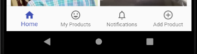

# Flutter
For those of you who don't know, [flutter](https://flutter.dev/) is an open-source UI software development kit created by Google. It is used to develop applications for Android, iOS, Windows, Mac, Linux, Google Fuchsia and the web. Google claims building beautiful native applications in record time, using flutter. And I couldn't agree more!  
So fasten your seat belts and get ready for fluttering through *College OLX*

# College OLX - A Flutter Application

A local rentals app with streaming notifications and UPI payments integrated, specially designed for International Institute of Information Technology, Naya Raipur.  
State management is done using [Provider Package](https://pub.dev/packages/provider)  
Data is stored and retrived from [Google Firebase](https://firebase.google.com/)

## Screenshots

<p align="center">
  &nbsp;&nbsp;&nbsp;&nbsp;&nbsp;&nbsp;&nbsp;&nbsp;&nbsp;&nbsp;&nbsp;&nbsp;&nbsp;&nbsp;&nbsp;&nbsp;&nbsp;&nbsp;&nbsp;&nbsp;
</p>

## Login/SignUp Screen
<p align= "center">
<br>
</p>

### Gradient  
Starting with the gradient in background, it can be added using [*LinearGradient*](https://api.flutter.dev/flutter/painting/LinearGradient-class.html) widget inside *BoxDecoration*. I've used this *BoxDecoration* inside *Container* Widget in the following code snippet:
```dart
Container(
            decoration: BoxDecoration(
              gradient: LinearGradient(
                colors: [Colors.white, Colors.indigo],
                begin: Alignment.topLeft,
                end: Alignment.bottomRight,
                stops: [0, 1],
              ),
            ),
          ),
```

### Red Box and Email-Pass Input Card
The Red Box with *College OLX* inside, has been fashioned using [*Flexible*](https://api.flutter.dev/flutter/widgets/Flexible-class.html) widget to give it the ability to expand in the available space. Decoration part of the container used inside Flexible is pretty standard as can be seen in the below code snippet:  
```dart
             child: Column(
                mainAxisAlignment: MainAxisAlignment.center,
                crossAxisAlignment: CrossAxisAlignment.center,
                children: <Widget>[
                  Flexible(
                    child: Container(
                      margin: EdgeInsets.only(bottom: 20.0),
                      padding:
                          EdgeInsets.symmetric(vertical: 8.0, horizontal: 94.0),
                      // ..translate(-10.0),
                      decoration: BoxDecoration(
                        borderRadius: BorderRadius.circular(20),
                        color: Colors.deepOrange.shade900,
                        boxShadow: [
                          BoxShadow(
                            blurRadius: 8,
                            color: Colors.black26,
                            offset: Offset(0, 2),
                          )
                        ],
                      ),
                      child: Text(
                        'CollegeOlx',
                        style: TextStyle(
                          color: Theme.of(context).accentTextTheme.title.color,
                          fontSize: 30,
                          fontFamily: 'Anton',
                          fontWeight: FontWeight.normal,
                        ),
                      ),
                    ),
                  ),
                  Flexible(
                    flex: deviceSize.width > 600 ? 5 : 4,
                    fit: FlexFit.loose,
                    child: AuthCard(),
                  ),
                ],
              ),
```
AuthCard is a custom widget to display they contents of form field based on the selected auth type (i.e., Login or signup), inside the flexible widget.

### Submit Button Functionality
Now this is the heart of the login/signup page. [*Provider Package*](https://pub.dev/packages/provider) is used to manage state in College OLX. Though there are a number of state-management packages available, I chose provider for it's sheer simplicity and to strengthen my concepts of state management.  
According to the selected auth type, either signIn or signUp methods of the Auth Class are called and errors in either processes are recorded which change the state of the page, as can be seen in the following snippet:
   
```dart
// Sign in
      await Provider.of<Auth>(context).signIn(
          email: _authData['email'].trim(),
          password: _authData['password'].trim());
      _loginErrorMessage = Provider.of<Auth>(context).getErrorMessage;
// Sign up
      await Provider.of<Auth>(context).signUp(
          email: _authData['email'].trim(),
          password: _authData['password'].trim(),
          name: _authData['SellerName'].trim(),
          address: _authData['address'].trim() +
              ' House, Room Number: ' +
              _authData['roomNum'].trim(),
          mobNum: _authData['mobileNum'].trim());
      _signUpErrorMessage = Provider.of<Auth>(context).getErrorMessage;
  
```
AuthData class which stores the infomation about the current user, is defined as follows:
```dart
class AuthData {
  String userId;
  String errorMessage;
  String userName;
  String userAddress;
  String userMobile;

  AuthData(
      {this.userId,
      this.errorMessage,
      this.userAddress,
      this.userMobile,
      this.userName});
}
```
The Auth Class is defined as a mixin of [*ChangeNotifier*](https://api.flutter.dev/flutter/foundation/ChangeNotifier-class.html) class as follows:
```dart
class Auth with ChangeNotifier
```
A mixin refers to the ability to add the capabilities of another class or classes to your own class, without inheriting from those classes. The methods of those classes can now be called on your class, and the code within those classes will execute. Dart does not have multiple inheritance, but the use of mixins allows you to fold in other classes to achieve code reuse while avoiding the issues that multiple inheritance would cause.  
The signIn method of Auth class, first signs in the user with given email and password into the FirebaseAuth, then stores the information of that user from firestore, into an object of AuthData.
```dart
  Future signIn({String email, String password}) async {
    try {
      // auth = new AuthData();
      FirebaseUser currUser = (await FirebaseAuth.instance
              .signInWithEmailAndPassword(email: email, password: password)
              .catchError((e) {
        print("SIGNIN ERROR: " + e.code);
        auth.errorMessage = e.code;
      }))
          .user;
      auth.userId = currUser.uid;
      auth.errorMessage = null;
      await Firestore.instance
          .collection("users")
          .document(currUser.uid)
          .get()
          .then((DocumentSnapshot result) {
            auth.userName = result['name'];
            auth.userAddress = result['address'];
            auth.userMobile = result['mobNum'];
      });
    } catch (e) {}
    notifyListeners();
  }
```
Similarly, the signUp function of Auth class, first creates a user in FirebaseAuth with given email and password, then stores other details such as name, address, etc. of the user to Firestore.
```dart
Future signUp(
      {String email,
      String password,
      String name,
      String address,
      String mobNum}) async {
    try {
      // auth = new AuthData();
      FirebaseUser currentUser = (await FirebaseAuth.instance
              .createUserWithEmailAndPassword(email: email, password: password)
              .catchError((e) {
        print("Singup ERROR" + e.code);
        auth.errorMessage = e.code;
      }))
          .user;
      auth.userId = currentUser.uid;
      auth.errorMessage = null;
      await Firestore.instance
          .collection("users")
          .document(currentUser.uid)
          .setData({
        'userId': currentUser.uid,
        'name': name,
        'address': address,
        'mobNum': mobNum,
      }).catchError((e) {
        print("WRITING USER INFO ERROR" + e.code);
      });
      auth.userAddress = address;
      auth.userMobile = mobNum;
      auth.userName = name;
    } catch (e) {}
    notifyListeners();
  }
}
```
Note: Both of the above functions [*notifyListeners*](https://api.flutter.dev/flutter/foundation/ChangeNotifier/notifyListeners.html) at the end who are responsible for changing the state of the application.

## Overview Screen
This screen is responsible to construct the bottom tab navigator which you see in the below picture.
<p align= "center">
<br>
</p>
Now, it could have been implemented using standard process mentioned in [link](https://api.flutter.dev/flutter/material/BottomNavigationBar-class.html) , but we've got a couple of things to handle to make it more UI friendly.<br>
Following are the things:<br>
* The navigation history should remain intact, even if we switch between different items in bottom navigation bar<br>
* On back button pressed at any page (except the Home page) in the bottom navigation bar, the user should be returned to the Home page.
To Start, let's first define the widgets we want the screen to change to, after we tap on one of the bottom navigator button.

```dart
  static final List<Widget> _widgetOptions = [
    ProductsGrid(),
    MyProducts(),
    Notifications(),
    AddItem(),
  ];
```
Then we create a private function called *_routeBuilders* which maps String to [*WidgetBuilder*](https://api.flutter.dev/flutter/widgets/WidgetBuilder.html) based on index. *WidgetBuilder* is nothing but a signature for a function that creates a widget.

```dart
  Map<String, WidgetBuilder> _routeBuilders(BuildContext context, int index) {
    return {
      '/': (context) {
        return [
          ProductsGrid(),
          MyProducts(),
          Notifications(),
          AddItem(),
        ].elementAt(index);
      },
    };
  }
```
Following this, is another Widget called *_buildOffStageNavigator* which we'll be using inside Stack widget. *OffStage* is a widget that lays the child out as if it was in the tree, but without painting anything, without making the child available for hit testing, and without taking any room in the parent. We use the *offstage* property of *OffStage* to decide whether the child is hidden from the rest of the tree. If true, the child is laid out as if it was in the tree, but without painting anything, without making the child available for hit testing, and without taking any room in the parent. If false, the child is included in the tree as normal.<br>
You can read more about them from [link1](https://api.flutter.dev/flutter/widgets/Offstage-class.html) and [link2](https://api.flutter.dev/flutter/widgets/Offstage/offstage.html)

```dart
  Widget _buildOffstageNavigator(int index) {
    print("INDEX INSIDE OFF STAGE" +
        index.toString() +
        "SELECTED INDEX" +
        _selectedIndex.toString());
    var routeBuilders = _routeBuilders(context, index);
    return Offstage(
      offstage: _selectedIndex != index,
      child: Navigator(
        key: _navigatorKeys[index],
        onGenerateRoute: (routeSettings) {
          return MaterialPageRoute(
            builder: (context) => routeBuilders[routeSettings.name](context),
          );
        },
      ),
    );
  }
```

We use the following property to control what to show:

```dart
offstage: _selectedIndex != index
```
We get value of _selectedIndex from BottomNavigationBar.<br>
So if _selectedIndex is the same as index, then offstage will be false and its child will be painted.<br>
And if _selectedIndex is not same as index, then offstage will be true and its child will not be painted.<br>

## Instructions for VS Code
### Run app without breakpoints
Click Debug > Start Without Debugging in the main IDE window, or press Ctrl+F5. The status bar turns orange to show you are in a debug session
### Run app with breakpoints
* If desired, set breakpoints in your source code.
* Click Debug > Start Debugging in the main IDE window, or press F5.
  * The left Debug Sidebar shows stack frames and variables.
  * The bottom Debug Console pane shows detailed logging output.
  * Debugging is based on a default launch configuration. To customize, click the cog at the top of the Debug Sidebar to create a         launch.json file. You can then modify the values.

## Instructions for Android Studio
* Locate the main Android Studio toolbar
* In the target selector, select an Android device for running the app. If none are listed as available, select Tools> Android > AVD Manager and create one there. For details, see Managing AVDs.
* Click the run icon in the toolbar, or invoke the menu item Run > Run.

